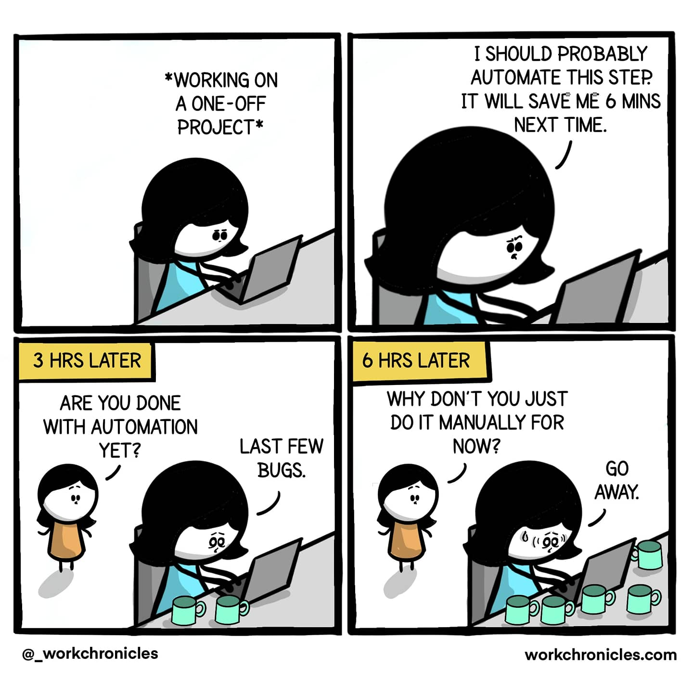
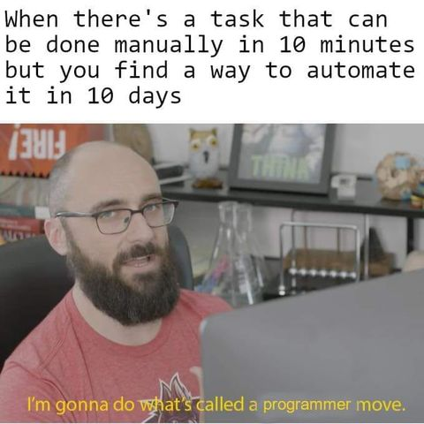
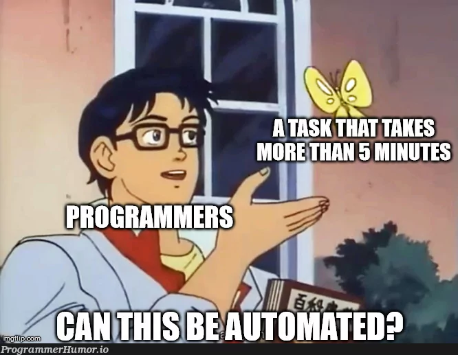
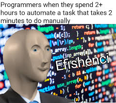

## What is Puppeteer?

Puppeteer is a Node.js library which provides a high-level API to control Chrome/Chromium over the DevTools Protocol. While it's primarily used for automating web tasks, Puppeteer can also be used for web scraping, testing, and creating snapshots of web pages.

## Features

Most things that you can do manually in the browser can be done using Puppeteer! Here are a few examples to get you started:

- Automate form submission, UI testing, keyboard input, etc.
- Create an automated testing environment using the latest JavaScript and browser features.
- Capture a [timeline trace](https://developers.google.com/web/tools/chrome-devtools/evaluate-performance/reference) of your site to help diagnose performance issues.
- Generate screenshots and PDFs of pages.
- Crawl a SPA (Single-Page Application) and generate pre-rendered content (i.e. "SSR" (Server-Side Rendering)).
