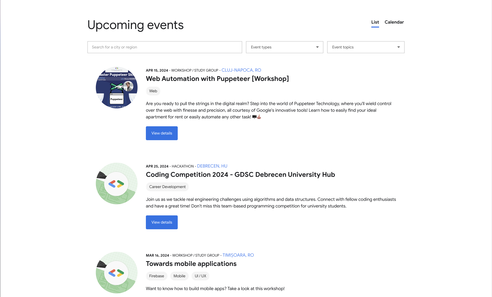

# Exercise: Web Scraping

Congrats! You have successfully completed the web scraping demo. Now it's time to put your skills to the test.

## Objective

You are the biggest GDSC fan, and you want to attend as many workshops as possible. You are able to go anywhere in the world, so the location is not a problem. For this, you want to scrape the GDSC events from the [GDSC website](https://gdsc.community.dev/events/#/list). For each event, you want to extract the title, date, location, description, image link, the tags associated with the event, and the url

## Steps

Before we begin writing the code, let's analyze the website and identify the structure of the page. We can see that the website has a list of upcoming events. Each event has a title, a date, a location, a description, an image, and tags. For each unique aspect of the event, we will try to identify the corresponding selector.

An event can have multiple tags that should be stored in an array.

At the bottom of the page, we have a button that loads more events, so no navigation is required. We see that if we click it multiple times, we can load all the events. Consider having all the events loaded before scraping the data.
