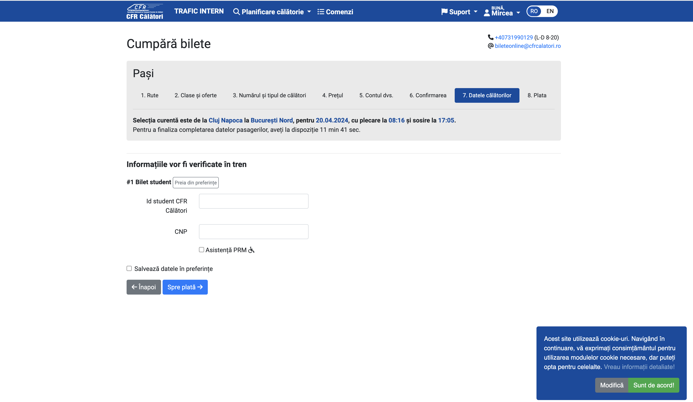

# Demo: Web Automation

Automations are a great way to save time and effort for repetitive tasks. In this demo, we will automate the process of purchasing a train ticket using Puppeteer. We will navigate to the [CFR website](https://www.irctc.co.in/nget/train-search), search for a train, and book a ticket.

For this demo, we will be using the advanced search feature available on the website. It allows us to sort the data based on various parameters like the duration of the journey, the departure time, and the arrival time.


## Criteria

We will search for a train from Cluj-Napoca to Bucharest. We will filter the results based on the following criteria:

- The journey duration should be as short as possible.
- The departure time should be after 8:00 AM.

## Journey Details

To make things easier, we'll complete the form in the website. The generated link is

https://bilete.cfrcalatori.ro/ro-RO/Rute-trenuri/Cluj-Napoca/Bucuresti-Nord?DepartureDate=20.04.2024&MinutesInDay=480&OrderingTypeId=2

We can observe that:

- In the url, we have the departure and arrival stations
- We have a parameter for the departure date, represented in the format dd.mm.yyyy
- We have a parameter for the time, represented in minutes since midnight. For example, 480 minutes is 8:00 AM, 720 minutes is 12:00 PM, and so on.
- We have a parameter for the ordering type, which in our case is 2, meaning that we want to sort the results by the duration of the journey.

We can extract those values as parameters in our script and generate the link dynamically, thus allowing us to buy tickets for multiple dates, times, and stations.

```javascript
import puppeteer from "puppeteer";

const JOURNEY = {
  DEPARTURE: "Cluj-Napoca",
  ARRIVAL: "Bucuresti-Nord",
  DEPARTURE_DATE: "20.04.2024",
  DEPARTURE_TIME: 480,
  ORDERING_TYPE: 2,
};

const URL = `https://bilete.cfrcalatori.ro/ro-RO/Rute-trenuri/${JOURNEY.DEPARTURE}/${JOURNEY.ARRIVAL}?DepartureDate=${JOURNEY.DEPARTURE_DATE}&MinutesInDay=${JOURNEY.DEPARTURE_TIME}&OrderingTypeId=${JOURNEY.ORDERING_TYPE}`;
```

In the code snippet above, we have defined the journey details and the URL for the search. We will use these constants in the subsequent chapters to automate the process of purchasing a train ticket. These can be easily modified to search for different journeys based on an user input.

## Selectors

Like in the previous chapters, we will define the selectors for the different elements on the page. We will use these selectors to interact with the page and extract the necessary information.

At a first glance, we see that we need selectors to interact with the following elements:

- Panels for the train
- Button to book the ticket

There will be more selectors updated later in the chapter.

```javascript
const SELECTORS = {
  TRAIN_PANEL: ".train-panel",
  BOOK_BUTTON: ".book-button",
};
```

## Delay function

In an automation, we'll interact directly with the elements, so we need to ensure that they are completely loaded before we interact with them. We can use a delay function to wait for a specified amount of time before proceeding with the next action.

```javascript
function delay(time) {
  return new Promise(function (resolve) {
    setTimeout(resolve, time);
  });
}
```

In the code snippet above, we have defined a `delay` function that returns a promise which resolves after the specified amount of time. We will use this function to wait for the elements to load before any interaction.

## Launching the browser

For better visualization, we will use the `headless: false` option to see the browser in action.

```javascript
async function run() {
  const browser = await puppeteer.launch({
    headless: false,
    defaultViewport: null,
    args: ["--start-maximized"],
  });
  const page = await browser.newPage();

  await page.goto(URL);
}
```

## Selecting the train

In this exercise, we will select the first train from the list, since it is the one with the shortest journey duration. We will click on the "Cumpără" button to proceed with the booking.

#### Disclaimer: There should be some extra checks, to ensure that the train is not too early or too late, but for the sake of simplicity, we will assume that the first train is the best one.

We will write a new function

```javascript
async function selectTrain(page) {
  await page.waitForSelector(SELECTORS.TRAIN_PANEL);

  const train = await page.$(SELECTORS.TRAIN_PANEL);

  await train.waitForSelector(SELECTORS.BUY_BUTTON);
  await delay(2000);

  const buyButton = await train.$(SELECTORS.BUY_BUTTON);
  await buyButton.evaluate((button) => button.click());
}

async funcion run()
{
    // previous code
    await selectTrain(page);
}
```

## Ticket type

Now, we are redirected to another page, where we can select the type of ticket we want to buy. We're happy with the default selection, so we will click on "Pasul următor", to proceed with the booking.


```javascript
const SELECTORS = {
  // previous selectors
  TICKET_TYPE_NEXT_BUTTON: ".next-button",
};

async function selectTicketType(page) {
  await page.waitForSelector(SELECTORS.TICKET_TYPE_NEXT_BUTTON);

  await delay(2000);
  const nextButton = await page.$(SELECTORS.TICKET_TYPE_NEXT_BUTTON);
  await nextButton.evaluate((button) => button.click());
}

async function run() {
  // previous code
  await selectTicketType(page);
}
```

## Number of tickets

On the third step, we need to select the number of tickets we want to purchase. We have 2 options: Either we write the value corresponding to the number of tickets we want to buy, or we click on the "+" button to increase the number of tickets. We will choose the second option.


We can see that, after we click on the "+" button, a modal will appear, where we need to confirm something. We'll click on the "Am înțeles" button to proceed.

```javascript
const SELECTORS = {
  // previous selectors
  TICKET_NUMBER_PLUS_BUTTON: ".plus-button",
  TICKET_NUMBER_POPUP_BUTTON: ".popup-button",
  TICKET_NUMBER_NEXT_BUTTON: ".next-button",
};

async function selectTicketNumber(page) {
  await page.waitForSelector(SELECTORS.TICKET_NUMBER_PLUS_BUTTON);

  await delay(2000);
  const plusButton = await page.$(SELECTORS.TICKET_NUMBER_PLUS_BUTTON);
  await plusButton.evaluate((button) => button.click());

  await page.waitForSelector(SELECTORS.TICKET_NUMBER_POPUP_BUTTON, {
    visible: true,
  });
  const popupButton = await page.$(SELECTORS.TICKET_NUMBER_POPUP_BUTTON);
  await popupButton.evaluate((button) => button.click());

  await page.waitForSelector(SELECTORS.TICKET_NUMBER_NEXT_BUTTON);
  await delay(2000);
  const nextButton = await page.$(SELECTORS.TICKET_NUMBER_NEXT_BUTTON);
  await nextButton.evaluate((button) => button.click());
}

async function run() {
  // previous code
  await selectTicketNumber(page);
}
```

## Price

Probably the easiest step, we just need to click on the "Pasul următor" button to proceed.

```javascript
const SELECTORS = {
  // previous selectors
  PRICE_NEXT_BUTTON: ".next-button",
};

async function selectPrice(page) {
  await page.waitForSelector(SELECTORS.PRICE_NEXT_BUTTON);

  await delay(2000);
  const nextButton = await page.$(SELECTORS.PRICE_NEXT_BUTTON);
  await nextButton.evaluate((button) => button.click());
}

async function run() {
  // previous code
  await selectPrice(page);
}
```

## Login

Before purchasing the ticket, we need to login. Those will be set up as constants in the script. For this step, we need to target the username and password fields, and the login button. We will use the `type` function to fill in the fields. After we login, we will click on the "Pasul următor" button to proceed.


```javascript
const USER_DETAILS = {
  USERNAME: "your_username",
  PASSWORD: "your_password",
};

const SELECTORS = {
  // previous selectors
  USERNAME_FIELD: "#usernameId",
  PASSWORD_FIELD: "#passwordId",
  LOGIN_BUTTON: ".login-button",
  YOUR_ACCOUNT_NEXT_BUTTON: ".next-button",
};

async function login(page) {
  await page.waitForSelector(SELECTORS.USERNAME_FIELD);
  await page.type(SELECTORS.USERNAME_FIELD, USER_DETAILS.USERNAME, {
    delay: 100,
  });

  await page.waitForSelector(SELECTORS.PASSWORD_FIELD);
  await page.type(SELECTORS.PASSWORD_FIELD, USER_DETAILS.PASSWORD, {
    delay: 100,
  });

  await page.waitForSelector(SELECTORS.LOGIN_BUTTON);
  const loginButton = await page.$(SELECTORS.LOGIN_BUTTON);
  await loginButton.evaluate((button) => button.click());

  await page.waitForSelector(SELECTORS.YOUR_ACCOUNT_NEXT_BUTTON);
  await delay(2000);
  const nextButton = await page.$(SELECTORS.YOUR_ACCOUNT_NEXT_BUTTON);
  await nextButton.evaluate((button) => button.click());
}

async function run() {
  // previous code
  await login(page);
}
```

## Confirm Selection

On this step, we need to confirm our selection. After clicking, we will click on the "Pasul următor" button to proceed. Until we confirm, we will not be able to proceed. For this, we'll use a function we did not mention before, the `waitForFunction` function.


```javascript
const SELECTORS = {
  // previous selectors
  CONFIRM_SELECTION_BUTTON: ".confirm-button",
  CONFIRM_SELECTION_NEXT_BUTTON: ".next-button",
};

async function confirmBooking(page) {
  try {
    await page.waitForSelector(SELECTORS.CONFIRM_BUTTON, {
      visible: true,
      timeout: 5000,
    });
    const confirmButton = await page.$(SELECTORS.CONFIRM_BUTTON);
    await confirmButton.evaluate((el) => el.click());
  } catch (error) {
    console.log("No confirm button");
  }

  console.log("Selection confirmed");
  await page.waitForFunction(
    (selector) => {
      const button = document.querySelector(selector);
      return button && !button.disabled;
    },
    { polling: "mutation" },
    SELECTORS.CONFIRM_NEXT_BUTTON,
  );

  await page.waitForSelector(SELECTORS.CONFIRM_NEXT_BUTTON);
  await delay(2000);
  const nextButton = await page.$(SELECTORS.CONFIRM_NEXT_BUTTON);
  await nextButton.evaluate((button) => button.click());
}

async function run() {
  // previous code
  await confirmBooking(page);
}
```

What does `waitForFunction` do? It waits for a function to return a truthy value. In our case, we are waiting for the confirm button to be enabled. We are using the `polling` option to check the condition every time the DOM is mutated. This is useful when we are waiting for an element to change its state.

## Travel Data

Thanks to the generosity of the Romanian Government, we have 90% discount for students. For this, we need to have the student card details linked to the account. In this sections, we can select from our preferences the student card, being the last step required to purchase the ticket.

When we click to select the student card, a modal will appear, where we need to confirm our selection. There can be multiple student cards, so we need to select the first one. After we confirm, we will click on the "Spre plată" button to proceed.



```javascript
const SELECTORS = {
  // previous selectors
  TRAVEL_DATA_PREFERENCES: ""
  SELECT_PASSENGER_PREFERENCES: "",
  TRAVEL_DATA_NEXT_BUTTON: "",
};

async function selectStudentCard(page) {
  await page.waitForSelector(SELECTORS.TRAVEL_DATA_PREFERENCES);
  const travelDataPreferences = await page.$(SELECTORS.TRAVEL_DATA_PREFERENCES);
  await travelDataPreferences.evaluate((button) => button.click());

  await delay(2000);

  await page.waitForSelector(SELECTORS.SELECT_PASSENGER_PREFERENCES);
  const selectPassengerPreferences = await page.$(
    SELECTORS.SELECT_PASSENGER_PREFERENCES
  );
  await selectPassengerPreferences.evaluate((button) => button.click());

  await delay(2000);

  await page.waitForSelector(SELECTORS.TRAVEL_DATA_NEXT_BUTTON);
  const travelDataNextButton = await page.$(SELECTORS.TRAVEL_DATA_NEXT_BUTTON);
  await travelDataNextButton.evaluate((button) => button.click());
}

async function run() {
  // previous code
  await selectStudentCard(page);
}
```

We're finally at the payment step. For this, we'll use fake data, since we're not actually going to buy the ticket.

## Payment

The payment is composed of 2 parts:

- Selecting to pay using an online credit card
- Filling the form with the card details


```javascript
const USER_DETAILS = {
  // previous user details
  CARD_NUMBER: "1234 5678 1234 5678",
  CARD_PERSON: "John Doe",
  CARD_EXPIRATION_MONTH: "12",
  CARD_EXPIRATION_YEAR: "2024",
  CARD_CVV: "123",
};

const SELECTORS = {
  // previous selectors
  SELECT_CARD_PAYMENT: "",
  SELECT_PAY_ONLINE: "",
  CARD_NUMBER: "",
  CARD_NAME: "",
  CARD_EXPIRING_MONTH: "",
  CARD_EXPIRING_YEAR: "",
  CARD_CVV: "",
  CARD_CONSENT: "",
  CARD_PAY_ONLINE: "",
};

async function handlePayment(page) {
  await page.waitForSelector(SELECTORS.SELECT_CARD_PAYMENT);
  const selectCards = await page.$(SELECTORS.SELECT_CARD_PAYMENT);
  await selectCards.evaluate((el) => el.click());

  await page.waitForSelector(SELECTORS.SELECT_PAY_ONLINE);
  const selectPayOnline = await page.$(SELECTORS.SELECT_PAY_ONLINE);
  await selectPayOnline.evaluate((el) => el.click());

  await page.waitForSelector(SELECTORS.CARD_NUMBER);
  await page.type(SELECTORS.CARD_NUMBER, USER_DETAILS.CARD_NUMBER, {
    delay: 100,
  });
  await page.type(SELECTORS.CARD_NAME, USER_DETAILS.CARD_PERSON, {
    delay: 100,
  });
  await page.type(
    SELECTORS.CARD_EXPIRING_MONTH,
    USER_DETAILS.CARD_EXPIRATION_MONTH,
    { delay: 100 },
  );
  await page.type(
    SELECTORS.CARD_EXPIRING_YEAR,
    USER_DETAILS.CARD_EXPIRATION_YEAR,
    { delay: 100 },
  );
  await page.type(SELECTORS.CARD_CVV, USER_DETAILS.CARD_CVV, { delay: 100 });

  await page.waitForSelector(SELECTORS.CARD_CONSENT);
  const consent = await page.$(SELECTORS.CARD_CONSENT);
  await consent.evaluate((el) => el.click());

  await page.waitForSelector(SELECTORS.CARD_PAY_ONLINE);
  const payOnline = await page.$(SELECTORS.CARD_PAY_ONLINE);
  await payOnline.evaluate((el) => el.click());
}

async function run() {
  // previous code
  await handlePayment(page);
  await browser.close();
}
```

Congratulations! You have successfully automated the process of purchasing a train ticket using Puppeteer. You can now run the script and see the magic happen.
