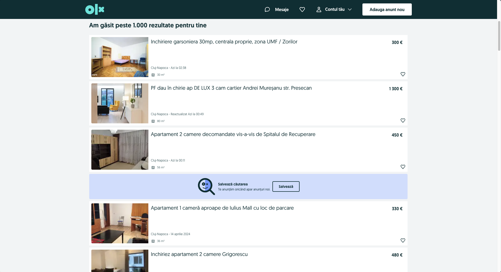

# Setting up constants

Welcome to the first chapter of the Web Scraping section! In this section, we will find all the anouncements listed on OLX for the apartments in Cluj-Napoca. We will use Puppeteer to scrape the data from the website and save it to a JSON file, for easier analysis.

In this chapter, we will set up the constants that we will use throughout the project. These constants will help us maintain consistency and readability in our code. We will define the URLs we want to scrape, the selectors we want to target, and other configuration options. Let's get started!

To begin with, we'll analyze the website, and identify the structure of the page.



We can see that the website has a list of announcements for apartments in Cluj-Napoca. Each announcement has a title, a price, a location (always Cluj Napoca), a surface area, an image, and an url. For each unique aspect of the announcement, we will try to identify the corresponding selector.

```javascript
import puppeteer from "puppeteer";

const URL =
  "https://www.olx.ro/imobiliare/apartamente-garsoniere-de-inchiriat/cluj-napoca/?currency=EUR";

// the values of the selectors are just placeholders, we will update them live during the workshop
const SELECTORS = {
  ANNOUNCEMENT: ".offer-wrapper",
  TITLE: ".offer-title",
  PRICE: ".price",
  SURFACE: ".surface",
  URL: ".url",
  IMAGE: ".image",
};
```

In the code snippet above, we have defined the URL of the OLX page we want to scrape and the selectors for the different aspects of the announcement. We will use these constants in the subsequent chapters to scrape the data from the website.

## Launching the browser

Now that we have set up the constants, we can proceed to launch the browser and navigate to the OLX page. We will use Puppeteer to automate this process. Let's write the code to launch the browser and navigate to the OLX page.

```javascript
async function run() {
  const browser = await puppeteer.launch();
  const page = await browser.newPage();

  await page.goto(URL);

  await browser.close();
}
```

In the code snippet above, we have defined an `async` function called `run` that launches the browser and navigates to the OLX page. We will call this function in the subsequent chapters to scrape the data from the website. The `run` function will be the entry point for our web scraping project, and we will build upon it in the upcoming chapters.

## Retrieving data

Now, we want to retrieve all the announcements from the page. For each announcement, we will extract the title, price, and surface.

If we look carefully at all the annoucements, we can see that not all contain information about the surface. If we access an annoucement that does not contain the surface, we will get an error (puppeteer errors are worse than C Compiler Messages). For the surface, we will wrap everything in a try-catch block, and if we get an error, we will just set the surface to "N/A".

```javascript
// continue from the previous code snippet, after page.goto(URL)
const data = [];

await page.waitForSelector(SELECTORS.ANNOUNCEMENT);

const announcements = await page.$$(SELECTORS.ANNOUNCEMENT);

for (const announcement of announcements) {
  let surface = "N/A";

  const title = await announcement.$eval(
    SELECTORS.TITLE,
    (el) => el.textContent
  );
  const price = await announcement.$eval(
    SELECTORS.PRICE,
    (el) => el.textContent
  );
  try {
    surface = await announcement.$eval(
      SELECTORS.SURFACE,
      (el) => el.textContent
    );
  } catch (e) {
    // do nothing
  }

  const imagePath = await announcement.$eval(SELECTORS.IMAGE, (el) => el.src);

  const url = await announcement.$eval(SELECTORS.URL, (el) => el.href);

  data.push({
    title: title,
    price: price,
    surface: surface,
    image: imagePath,
    url: url,
  });
}
```

Alright! We have successfully retrieved the data from the first page. But there are a lot more pages to scrape, and with the rate of rentals in Cluj, even the announcement from the last page are at most 2 weeks old. We will need to navigate to the next page and retrieve the data from there as well.

## Navigation to another page

OLX paginates data. We will need to navigate to the next page and retrieve the data from there as well. At the bottom of the page, there is an arrow that moves to the next page. Inside the arrow, there is an anchor tag that we can click to navigate to the next page, for which we'll want to retrieve the url. Furthermore, on the last page, the arrow does not exist, so this is a good way to check if we still have pages to scrape.

First step is to update the selectors with the new ones.

```javascript
const SELECTORS = {
  ANNOUNCEMENT: ".offer-wrapper",
  TITLE: ".offer-title",
  PRICE: ".price",
  SURFACE: ".surface",
  URL: ".url",
  IMAGE: ".image",
  NEXT_PAGE: ".pager .next a",
};
```

Next, we need a cycle to navigate through all the pages. We will use a `while` loop to navigate to the next page until the "Next" button is no longer available.

```javascript
while (true) {
  console.log("Scraping page " + page.url());
  // code is exactly the same as before

  // navigate to the next page
  // since the element might not be available, we will wrap it in a try-catch block
  try {
    const nextPageURL = await page.$eval(SELECTORS.NEXT_PAGE, (el) => el.href);
    await page.goto(nextPageURL);
  } catch (e) {
    console.log(e);
    break;
  }
}
```

Cool! Now we have all the data from all the pages. We can save it to a JSON file for further analysis.

## Saving the data

Finally, we will save the data to a JSON file. We will use the `fs` module to write the data to a file named `data.json`.

```javascript
// at the beginning of the file
import fs from "fs";

async function run() {
  // code to scrape the data

  fs.writeFile("data.json", JSON.stringify(data), (err) => {
    if (err) throw err;
    console.log("File Saved");
  });

  await browser.close();
}
```

That's it! We have successfully set up the constants, launched the browser, retrieved the data, navigated to the next page, and saved the data to a JSON file.
